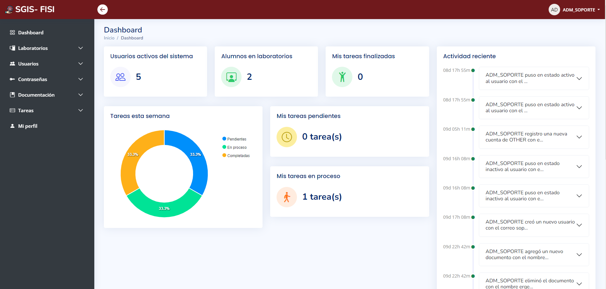

# Sistema gestor de soporte técnico
Un sistema integral para la oficina de soporte de la Facultad de Ingeniería e Informática

## Módulos:

- Autentificación de usuarios: Inicio de sesión seguro para usuarios y administradores.
- Gestión de contraseñas: Almacenamiento seguro de contraseñas con encriptación SSL.
- Gestión de documentación: Creación, edición y visualización de documentos internos.
- Préstamo de laboratorios: Registro y control de préstamos de laboratorios mediante código de barras del carnet universitario.
- Gestión de tareas: Creación, seguimiento y actualización de tareas con códigos UUID.
## Tecnologías:

- Backend: PHP con CodeIgniter 4
- Base de datos: MySQL
- Interfaz: HTML, CSS, JS
- Diseño: Bootstrap
## Beneficios:

- Mejora la eficiencia en la gestión de solicitudes de soporte.
- Agiliza el proceso de préstamo de laboratorios.
- Facilita la comunicación entre el equipo de soporte y los usuarios.
- Optimiza la gestión de tareas y proyectos.
- Mayor seguridad en el almacenamiento de información.
